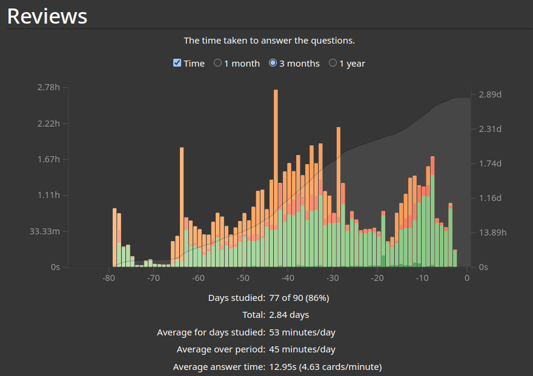

# ZSV, SGPCE

Tento repository obsahuje Anki balíček vytvořený pro přípravu na maturitu ze společenských věd. Skládá se z téměř 1800 kartiček vytvořených z mých zápisů a zápisů ročníků přede mnou, které se ke mě dostaly. Tyto zápisy jsou zde také přístupné.

## Obsah

Kartičky jsou tématicky rozdělené do 25 maturitních otázek. Kvalita bohužel není konsistentní. Některé jsem tvořil několik měsíců před maturitou, jiné v týden maturity. Něco bude chybět, a něco bude špatně (odhadem se jedná ale jen o jednotky procent). Bohužel, ani paní Nováková není bezchybná a občas některé věci opomene a pak se vás na ně zeptá u maturity. Občas dokonce řekne něco prokazatelně špatně.

## Instalace Anki

1. **Stažení  a instalace Anki:**
   - Navštivte [oficiální stránky Anki](https://apps.ankiweb.net) a stáhněte si verzi pro váš operační systém (Windows, macOS, Linux).
   - Postupujte podle pokynů na stránkách pro instalaci Anki na váš počítač.

2. **Stažení a Import Balíčku:**
   - Stáhněte si tento repository jako ZIP soubor nebo použijte git pro klonování repository:
     ```bash
     git clone https://github.com/kXtof/zsv-sgpce.git
     ```
   - Otevřete Anki a jděte na `File` > `Import`.
   - Vyberte soubor `ZSV.apkg`, který jste stáhli z tohoto repository, a importujte ho.

## Jak správně používat Anki

*Anki není nástrol pro učení, jedná se o nástroj pro pamatování!* 

Dle našich zápisů bychom řekli, že Anki pomáhá s vštěpovací a uchovávací fází paměti. Co tím myslím, je, že dřív, než začneme s biflováním definic počitků, vjemů či socializace, měli bychom pochopit, co tyto pojmy znamenají. Jedině pak si tyto informace budeme efektivně pamatovat.

Většina lidí, které jsem s Anki seznámil, nejprve absolutně nepochopila, jak tento nástroj funguje. Myslí si, že stačí jednou projít každou kartičku a pak už ji umí, případně že místo toho, aby se snažili o aktivní reprodukci, jen kliknou na answer a přečtou si odpověď. To pak není nic víc než ztráta času. 
Účinné využití Anki vyžaduje dedikaci a důslednost. Při procházení se **musíme snažit vzpomenout** . Jedině tak dojde k efektivnímu vštěpování informací. Stejně tak důležité je **procházet každý den** a dokončit všechny *reviews*, které nám Anki na ten den přiřadí.

Pro hlubší pochopení a seznámení se s Anki vřele doporučuji shlédnout nějaké návody na YouTtube. Je jich hojný výběr a pro běžné využití jsou více než dostačující.

Doporučený postup učení:

 1. Vybereme si otázku, kterou se chceme naučit.
 2. Procházíme zápisy a snažíme se pochopit kontext, význam pojmů, spojitosti s jinou látkou. Obecně bychom měli přesně vědět, o co se jedná, a až poté můžeme začít s kartičkama.
 3. Nejlépe v průběhu několika dnů se postupně učíme kartičky patřící otázce, kterou jsme procházeli.
 4. Opakujeme 1-3.
 5. Nejlépe tyden před maturitou už bychom neměli mít žádné nové kartičky. Teď už bychom měli jen opakovat.

## Efektivita?

Má příprava na maturitu ze ZSV spočívala ve tvorbě tohoto decku a v jeho následném využívání. Dohromady jsem čistě jen procházením strávil 2,84 dne, neboli cca 68 hodin. Zní to jako šílená doba, ale rozložená na dva měsíce to už tak nemožné není. Rozložené na ještě delší dobu (což vřele doporučuji) a můžete celý svaťák jen spatřovat hedoné v ethanolu.



Má strast ale přinesla ovoce, paní Nováková mně dokonte i říkala křestním 💀.

## Přispívání

Pokud najdete chyby nebo máte návrhy na zlepšení, neváhejte otevřít issue nebo pull request.

## Licence

Tento projekt je licencován pod MIT licencí. Více informací naleznete v souboru LICENSE.

